# 2822: Fast iterative development and modern cloud-native Java developer experience with Liberty Tools

**Duration:** 90 minutes

Need support? Contact:

  - **Tom Alcott** - alcott@us.ibm.com

  - **Megan Irvine** - mirv@us.ibm.com

## Description
The new Liberty Tools enable developers to rapidly iterate and easily write, test and debug cloud-native Java applications that are running on Liberty by using popular integrated development environments (IDE) such as Eclipse IDE, IntelliJ IDEA, and Visual Studio (VS) Code.  

In this exercise, you learn how to use Liberty in `dev` mode with VS Code IDE for achieving an efficient and iterative develop, test and debug cycle when developing Java-based applications and microservices.

## Objectives
At the end of this session you should be able to:

- Use the Open Liberty Tools extension available in VS Code to efficiently develop, test and debug Java cloud-native applications.

- Observe hot-reloading of application code and configuration changes by using `dev` mode.

## Lab requirements
The lab environment for this session is installed and configured with all the prerequisite software.

## Introduction: Liberty Tools extension for VS Code
In this lab session, you use the **Liberty Tools** extension to in VS Code to run tests on demand so that you can get immediate feedback on your changes. You also work with integrated debugging tools and attach a Java debugger to debug your running application.

The Liberty Tools for VS Code extension contains the following key Features:

- View `liberty-maven-plugin` projects in the workspace (version 3.1 or higher)

- View `liberty-gradle-plugin` projects in the workspace (version 3.0 or higher)

- Start and stop an Open Liberty Server in `dev` mode

- Start an Open Liberty Server in `dev` mode with custom parameters

- Run unit and integration tests

- View unit and integration test reports

The Liberty Tools for VS Code extension depends on the **Tools for MicroProfile** VS Code extension to support the development of MicroProfile-based microservices.

The **Tools for MicroProfile** VS Code extension has the following dependencies:

  - Java JDK (or JRE) 11 or later

  - Language Support for Java by Red Hat VS Code extension

### Liberty `dev` mode
When running Liberty in `dev` mode, your code is automatically compiled and deployed to the server, making it easy to iterate on your changes. You can run Liberty `dev` mode from a command line while you edit your code with any text editor or IDE. From a developer perspective, this is a huge gain in efficiency, as these iterative inner-loop development activities occur without ever leaving the IDE.

### Liberty Maven Plugin

The **Liberty Maven Plugin** provides several goals for managing Liberty servers and applications.Maven 3.5.0 or later is recommended for use with the Liberty Maven Plugin. To enable the Liberty Maven Plugin in your project, add the following XML Stanza to your `pom.xml` file.

>For more information about the Maven goals that are supported by the Liberty Maven Plugin, go to: <https://github.com/OpenLiberty/ci.maven>

### Interacting with `dev` mode

When the Liberty Maven Plugin is specified in your `pom.xml` file, your project name is then listed under the **LIBERTY DASHBOARD** in the side panel in VS Code, as shown in the screen capture. You can interact with `dev` mode by right-clicking your project name and selecting one of the commands that are supported by the Liberty Tools extension. The following commands can be selected from the drop-down menu after right-clicking your project name in the **LIBERTY DASHBOARD**:

   
    
## 1.0 Accessing the lab environment

An environment is provisioned for you for this lab session. The instructor or lab proctor can provide details for accessing the lab environment.

The lab environment contains one Linux VM named **Workstation**.
    
The Ubuntu Linux **Workstation** VM is installed with the following softare for the lab session:
  
  - Application Project with Liberty
  - Maven 3.6.0 

1.  Access the lab environment from your web browser. 
    
    On the **Workstation** tile, click the **ubuntu** screen logo to open the lab environment. 
    
    
    
2.  Log in with user ID `ibmdemo` and password `passw0rd`.
    
    a.  Click **ibmdemo** on the log in screen.

    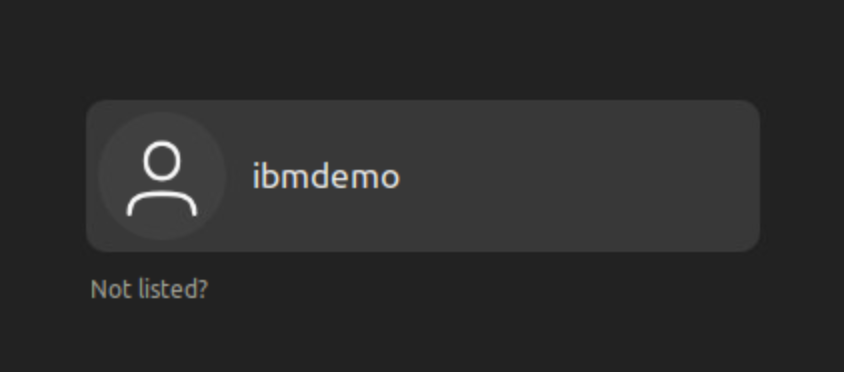

    b. Enter `passw0rd` for the password, all lowercase with a `0` (zero) instead of the letter 'o'.
 
    
	
3.  The desktop opens, which contains all the programs that you use (web browser, terminal, and so on) during the session.

    

>**IMPORTANT:** If, at any time during the lab, you are prompted to install updated software onto the VM, **DO NOT install the update**. Click **Cancel**. These lab instructions are intended for a specific version of software, which must not be udpated at this time.

### Tips for working in the lab environment     

1. The UI allows you to fit the viewing area to fit the browser window size that you are using.

    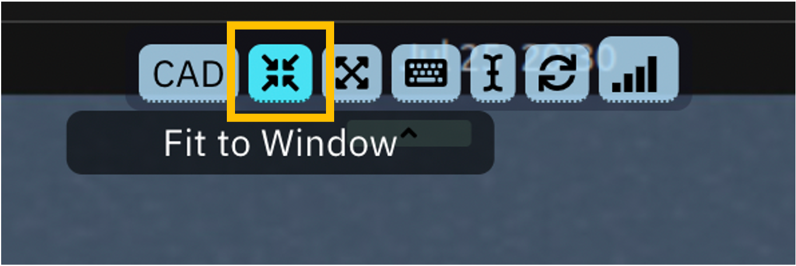

2.  You can copy and paste text from the lab guide into the lab environment by using **Send Text** clipboard. 
   
    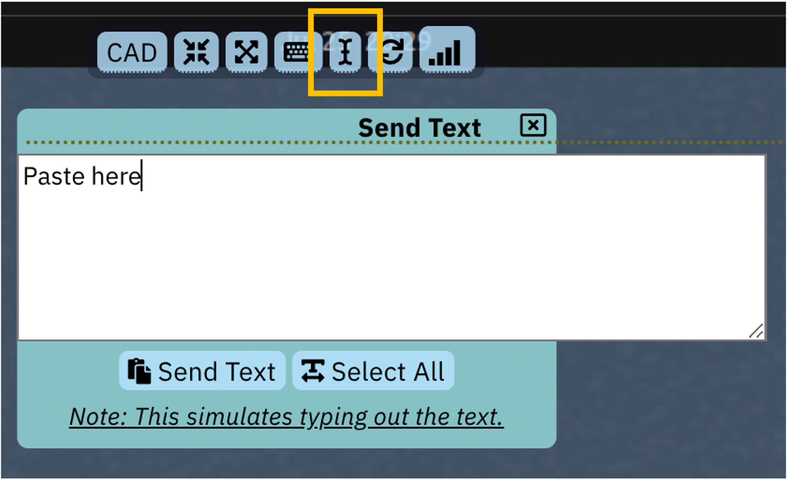
    
    > **NOTE:** Sometimes pasting into a terminal window in the VM does not work consistently. In this case, you can try pasting the text into a **Text Editor** in the VM, and then copy and paste into the terminal window. 

## 2.0 Getting Started with Liberty Tools in VS Code

### 2.1 Review the VS Code extensions for this project

1. First, add the project folder to a VS Code workspace.

    a.  Close all terminal windows and browser tabs that were used in any previous labs, if necessary.

    b.  Open a terminal window and change to the following directory:

        cd /home/ibmdemo/Student/labs/devmode/guide-getting-started/start

2.  Launch VS Code using the current directory (.) as the root folder for the workspace:

        code .

    The VS Code UI launches and displays the **Explorer** view. The **START** folder contains the source code for the project.

    
    
3.  Review the installed extensions in VS Code that are used for this lab.
    
    a.  Click the **Extensions** icon in the left navigation bar in
        VS Code.
        
    

    b.  Expand the **INSTALLED** extensions section to list the extensions that are currently installed in this environment. The notable extensions are:
    -  Liberty Tools
    -  Tools for MicroProfile
    -  Language Support for Java
    -  Debugger for Java
    
    c.  Click the **Liberty Tools** extension to view its details.

    
    
    d. Notice the list of commands that are supported by the Liberty Tools extension.
        
    e. Scroll down to the **Requirements** section of the Liberty Tools details page.
        
    >**Note:** The **Tools for MicroProfile** extension for Visual Studio Code is required to support development of Microservices that use MicroProfile APIs with Liberty.
        
    

4.  Close the **Liberty Tools Extension** details page (click the **X** on the tab).

### 2.2 Review the `pom.xml` file for the `system` microservice

The sample application that is used in this exercise is built by using Maven. Every Maven project contains a `pom.xml` file, which defines the project configuration, dependencies, plug-ins, and so on. Your `pom.xml` file is in the root directory of the project and is configured to include the `liberty-maven-plugin`, which allows you to install applications into Liberty and manage server instances.
    
1.  Click the Explorer icon in the left navigation menu in VS Code.

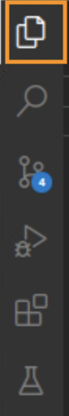
    
2.  Expand the **START** folder.
        
    
    
3.  Click the `pom.xml` file to open it in the editor pane.
    
    >**Note:** Close any Pop-up boxes asking if you want to install extensions or switch views. You can ignore these prompts for the duration of the lab. 

    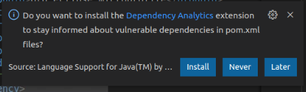
    
    a.  Note the binary packaging of the Java application WAR file that
        is produced from the Maven Build. The WAR file is named `guide-getting-started` version `1.0-SNAPSHOT`.
        
    
    
    b.  Default HTTP and HTTPS Ports are defined, and substituted into
        the `server.xml` file
        
    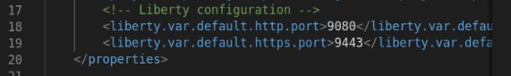
    
    c.  The Liberty Tools Plugin is enabled, with a supported version of 3.3.4.
        
    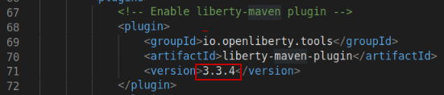
    
    d.  A plugin for running tests is also added to the Maven configuration, which leverages the testing dependencies defined in the `pom.xml` file.
        
    
    
4.  Close the `pom.xml` file (click the **X** on the tab).

>**Note:** You can find more information on the `liberty-maven-plugin` at: <a href="https://github.com/OpenLiberty/ci.maven">https://github.com/OpenLiberty/ci.maven</a>

## 3.0 Use Liberty Tools in VS Code 

In this section of the lab, you use the Liberty Tools in VS Code to run tests on demand, so that you can get immediate feedback on your changes.

VS Code provides extensions for Java to support the Java language features for Liberty Tools. VS Code for Java supports two modes:

- Lightweight mode

- Standard mode

The VS Code default configuration is called hybrid mode, where a workspace is opened in Lightweight mode, but as needed, you are prompted to switch to Standard mode.

The Tools for MicroProfile extension, which is required for the Liberty Tools extension, requires the Java workspace to be opened in Standard mode. Otherwise, the **LIBERTY DASHBOARD** does not function properly.

In this lab environment, the workspace is already configured to use Standard mode.

>You can find more details on VS Code for Java here: <a href="https://code.visualstudio.com/docs/java/java-project">https://code.visualstudio.com/docs/java/java-project</a> 

### 3.1 Start Liberty in `dev` mode

1.  Use the **LIBERTY DASHBOARD** to start the Liberty Server in `dev` mode.
    
    a.  In VS Code, expand the **LIBERTY DASHBOARD** section.
    
    b.  Right-click the **guide-getting-started** Liberty Server and select **Start** from the menu to start the server.
        
    
    
    c.  The **TERMINAL** view opens in VS Code that displays the server log messages as the server starts. When the following message appears, the Liberty server is started.
        
    

2.  View the `system` sample application in a web browser.
    
    a.  Open a web browser in the VM.
    
    b.  Go to <http://localhost:9080> to verify that the application is running.
        
    

    c. Close the browser window. 

### 3.2 Implement a health check in an application 

The System Properties sample application is now running in the Liberty server. Next, you implement a health check for the application.

In this part of the lab, you explore the efficient developer experience by implementing new capabilities into a service. In this example, you leverage the `mpHealth-2.2` feature in Liberty, which implements the MicroProfile `mpHealth-2.2` API, to implement health checks for the application.

The `mpHealth-2.2` feature provides a `/health` endpoint that represents a binary status, either `UP` or `DOWN`, of the microservices that are installed.

> To learn more about the MicroProfile Health feature, visit: <https://www.openliberty.io/docs/21.0.0.4/health-check-microservices.html>

1.  Update the Liberty server configuration file (`server.xml`) to include the `mpHealth-2.2` feature to begin implementing the health checks for the application.
    
    a.  In the VS Code Explorer view, expand **START** > **src** > **main** > **liberty/config**.
    
    b.  Click `server.xml` to open the file in the editor pane.
        
    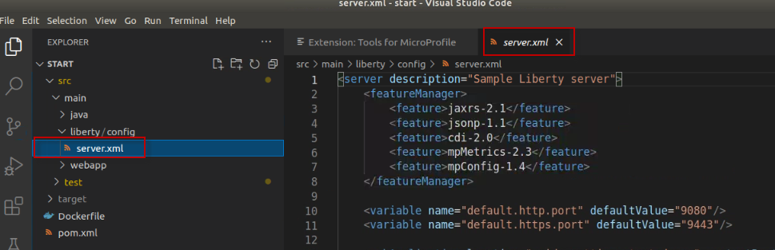
    
    c.  Add the `mpHealth-2.2` feature to the `server.xml` file by inserting this line into the `<featureManager>` block:

        <feature>mpHealth-2.2</feature>

    

2.  Save and close the `server.xml` file. 

    a. In the main VS Code menu, click File and select **Save**.

    b. Click the **X** on the tab in the editor to close the file. 
    
    > When you save the `server.xml` file, the server detects the configuration changes, and the server installs the new feature and updates the application.

3.  Notice the messages that display in the **TERMINAL** view in VS Code, showing the feature being installed and the application being updated.
    
    
    
    > After changes are saved, and the server is updated, the new `/health` endpoint becomes available.

4.  In a browser in the VM, access the `/health` endpoint to view the health status of the application:

        http://localhost:9080/health

    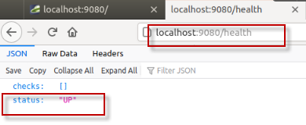

> The basic health check provides a simple status that indicates if the service is running, but not if it is healthy. In the next steps, you implement a *liveness* check that implements logic that gathers memory and CPU usage information. If the system resources exceed a certain threshold, it reports the service as `DOWN` with the health check.

> You also implement a *readiness* check that checks external property configuration in the `server.xml` file, and is used to place the service in maintenance mode. If the service is placed in maintenance mode, the service is marked `DOWN` with the health check.

5.  Copy an implementation of the `SystemReadinessCheck.java` to the project.
    
    a.  Open a terminal window in the VM.
    
    b.  Run the following command to copy the `SystemReadinessCheck.java` to the project:

        cp /home/ibmdemo/Student/labs/devmode/guide-getting-started/finish/src/main/java/io/openliberty/sample/system/SystemReadinessCheck.java /home/ibmdemo/Student/labs/devmode/guide-getting-started/start/src/main/java/io/openliberty/sample/system/SystemReadinessCheck.java

    >**Note:** For the purpose of this lab, the `cp` command above copies a fully implemented readiness check from the `finished` project into the current working project (`start`). If you have difficulty copying and pasting the command in a terminal window, you can try copying the file by using the GUI **Files** application in the VM. 

6.  Review the `SystemReadinessCheck.java` implementation.
    
    a.  Return to the VS Code **Explorer** view.
    
    b.  Expand **START > main > java/io/openliberty/sample/system**.
    
    c.  Click the `SystemReadinessCheck.java` file to open it in the editor pane.
        
    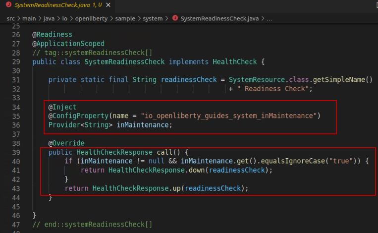
        
    The system readiness check evaluates the `inMaintenance` config property, which is implemented by using the `mpConfig` MicroProfile feature, and configured in the Liberty `server.xml` file.
    
    - If the `inMaintenance` property is set to `false`, the readiness check sets the health status to `UP`.
    
    - If the `inMaintenance` property is set to `true` the status is set to `DOWN`.

7.  View the `/health` endpoint in the browser again to see the health status of the application.

        http://localhost:9080/health

    

    >**Note:** While implementing the new readiness check code in the application, you did not have to restart the application or Liberty Server. The Liberty Tools extension detected the code changes in the project and dynamically updated the application in the running server.

8.  Copy an implementation of the `SystemLivenessCheck.java` to the project
    
    a  Open a terminal window in the VM.
    
    b.  Run the following command to copy the `SystemLivenessCheck.java` file to the project:

        cp /home/ibmdemo/Student/labs/devmode/guide-getting-started/finish/src/main/java/io/openliberty/sample/system/SystemLivenessCheck.java /home/ibmdemo/Student/labs/devmode/guide-getting-started/start/src/main/java/io/openliberty/sample/system/SystemLivenessCheck.java

    >**Note:** For the purpose of this lab, the `cp` command above copies a fully implemented liveness check from the `finished` project into the current working project (`start`). If you have difficulty copying and pasting the command in a terminal window, you can try copying the file by using the GUI **Files** application in the VM. 

9.  Review the `SystemLivenessCheck.java` implementation.
    
    a.  Return to the VS Code **Explorer** view.
    
    b.  Navigate to **START > main > java/io/openliberty/sample/system**.
    
    c.  Click the `SystemLivenessCheck.java` file to open it in the editor pane.
        
    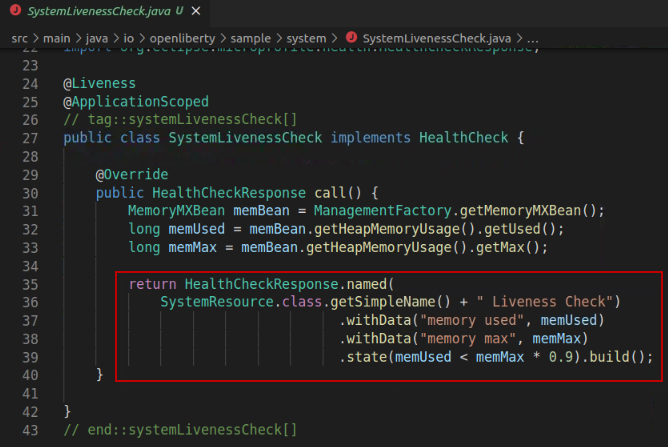
        
    The liveness check evaluates the memory and CPU resources that are used.
        
    - If the memory used is less than 90 percent, the liveness probe sets
        the status to `UP`.
    
    - If the memory used is greater than 90 percent, the liveness probe
        sets the status to `DOWN`.

9.  View the `/health` endpoint in the browser again to see the health status of the application.

        http://localhost:9080/health

    

    >**Note:** In the case where there are multiple health checks being performed, as in this example, all health checks must have a status of `UP` for the service to be marked `UP`.

>**Question:** What happens when you change the `inMaintenance` property to `true`? In the next steps, you modify the external configuration to set the service in maintenance mode and see the results of the health checks.

10. Modify the `inMaintenance` property in the `server.xml` file.
    
    a.  Return to the VS Code console and go to **START > src > main > liberty/config**.
    
    b.  Click `server.xml` to open the file in the editor.
    
    c.  Change the `inMaintenance` variable value to `true`.
        
    

    d. Save the `server.xml` file. The server configuration is dynamically updated to reflect the change.  

11. In the browser in the VM, view the `/health` endpoint again to view the health status of the application.

        http://localhost:9080/health

12. In the `server.xml` file, change the `inMaintenance` variable back to `false`.
    
    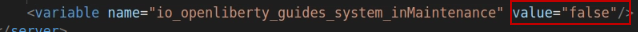

13. Save and close the `server.xml` file.
         
14. View the `/health` endpoint again to verify that the service is now marked `UP`.
    

## 4.0 Running Tests using the Open Liberty Tools in VS Code

In this section of the lab, you make some changes to the sample application code and run test cases directly from the VS Code IDE by using the built-in capabilities in the Open Liberty tools.

To simulate a breaking change in the application code, you modify the path to the service endpoint from `/properties` to `/all-properties`.

Because the test case attempts to run the system service using the `/properties` path, the test case fails and returns an HTTP Code of 404, rather than the expected response code of 200.

Since you are purposely introducing this change, the test case must be updated to reflect the new path to the service for the tests to pass.

1.  Use the Liberty Dashboard to run tests against the System Properties sample service.
    
    a.  In VS Code, expand **LIBERTY DASHBOARD**.
    
    b.  Right-click the **guide-getting-started** Liberty server.
    
    c.  Select **Run tests** from the menu to run the tests.
        
    
    
    d.  In the **TERMINAL** view, you see the results of the tests. One test was executed, and one test PASSED.
        
    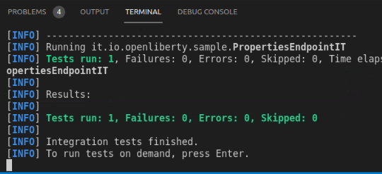

>Next, as a developer on the project, you are asked to change the code to specify a different path to the `properties` service. By doing so, it has an impact on the tests. In the next few steps, you make the code change and update the tests to match the new expected results.

2.  Edit the `SystemResource.java` file.
    
    a.  In VS Code **Explorer** view, expand **START > src > main > java/io/openliberty/sample/system**.
    
    b.  Click `SystemResource.java` to open it in the editor.
        
    

3.  Update the `@Path` to the system properties service to specify a different service path.
    
    a.  In the editor, make the following change to the `systemResource.java` file. Change the highlighted line:
 
    
 
    To read: `@Path("/all-properties")`
 
    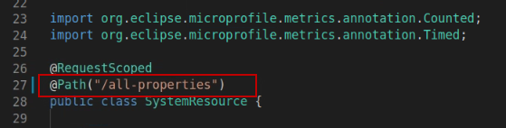

    b.  Save and close the file. The Liberty server and application is dynamically updated.

4.  In the browser in the VM, run the service by using the new endpoint URL:

        http://localhost:9080/system/all-properties

5.  In the Liberty Dashboard, run tests against the System Properties sample service.
    
    a.  In VS Code, expand the **LIBERTY DASHBOARD**.
    
    b.  Right-click the **guide-getting-started** Liberty Server.
    
    c.  Select **Run tests** from the menu again.
        
    
    
    d.  Alternatively, you can run the tests by pressing the **ENTER** key while the cursor is in the **TERMINAL** view. 

    >Notice that the tests failed.

6. Use the Liberty Dashboard to view the **integration test report**.
    
    a.  In VS Code, expand **LIBERTY DASHBOARD**.
    
    b.  Right-click the **guide-getting-started** Liberty server.
    
    c.  Select **View integration test report** from the menu.
        
7.  View the test results in the **Failsafe Report** that displays in a new pane.
           
    
    
    a.  Scroll to the bottom of the report to see the error message that was produced from the failed test.
        
    
    
    >Notice the issue. Since you changed the endpoint path, the test case assertion failed because it received an HTTP response code of 404 (Not Found) when attempting to run the service by using the original path of `/properties`. You can expect the test to fail in this case. As the developer, you must update the test case to match the expected results based on to your code change.
    
    b.  Close the **Failsafe Report**.

8.  Modify the test case to invoke the updated path to the service.
    
    a.  In the **EXPLORER** view in VS Code, expand **START > src > test/java/it/io/openliberty/sample**.

    >**Note:** This is in the `test` branch of the project, not in `main`.
    
    b.  Click `PropertiesEndpointIT.java` to open it in an editor.
    
    c.  In the editor, make the following change to the `PropertiesEndpointIT.java` file:

    Change the highlighted line: `system/properties`
 
    
 
    To read: `system/all-properties`
 
    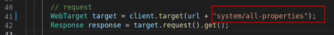

    d.  Save and close the file. The Liberty server and application are dynamically updated.

9.  Rerun the tests by pressing the **ENTER** key in the **TERMINAL** view. 

> This time, you see the test **PASS**.

At this point, you explored Liberty Developer Tools to develop code, make server configuration changes, and run test cases to get immediate feedback on the updates. Liberty Tools in VS Code provides an integrated development environment where your updates are automatically detected and dynamically applied to the running server. This provides a rapid inner-loop development cycle for development and testing.
    
In the next (optional) section of the lab, you explore how to integrate application debugging into the same development environment without having to restart the Liberty server.

## 5.0 Integrate debugging by using Liberty Tools in VS Code 

Application debugging is an important part of application development. Developers expect to easily and quickly iterate through a dev > test > debug cycle without having to leave the development environment or having to restart servers and applications for debugging.

In this section of the lab, you explore how to debug Java application by using VS Code and Open Liberty. One of the key features of VS Code is its debugging support.

Here are the basics steps for debugging:

- Set a breakpoint in the source code

- Add a “Java Attach” in the launch configuration and set the debug
    port

- Go to Debug view and select the “Attach” configuration

- Click the Start debugging icon

- Run the application in the Browser

- The application stops at the breakpoint

- Step through the app in debug mode to explore the variables and code
    to resolve issues
        
In this section of the lab, you will use VS Code debugger to debug the Java application that is running on Liberty server.
    
  
    
First, you set a breakpoint and debug the `SystemLivenessCheck.java` code that is executed when running the `/health` endpoint in the application.

1.  Open the `SystemLivenessCheck.java` file in VS Code editor.
    
    a.  In VS Code **EXPLORER** view, expand **START > src > main > java/io/openliberty/sample/system**.
    
    b.  Click `SystemLivenessCheck.java` to open it in the editor.
        
    

2.  Insert a breakpoint in the code where the `MemoryMaxBean` variable is set.
    
    a.  Find this line in the code:
        
            MemoryMXBean memBean = ManagementFactory.getMemoryMXBean();
    
    b.  Place your curosor on the left side of the line number (`31`) and click to set a breakpoint. A red dot appears, which indicates that the breakpoint is set.

    >**Note:** The line number where you set the break point might differ from what is shown in the screen capture.
        
    

3.  Create a new Java Attach configuration and specify the debug port `7777`.
    
    a.  In the main menu of VS Code, click **Run** and select **Add Configuration…**.
        
    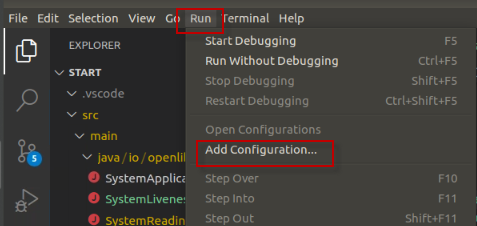
        
    A new file named `launch.json` is created in the `.vscode` directory and displayed in the editor.
    
    b.  Click **Add Configuration** in the lower right corner of the pane.
        
    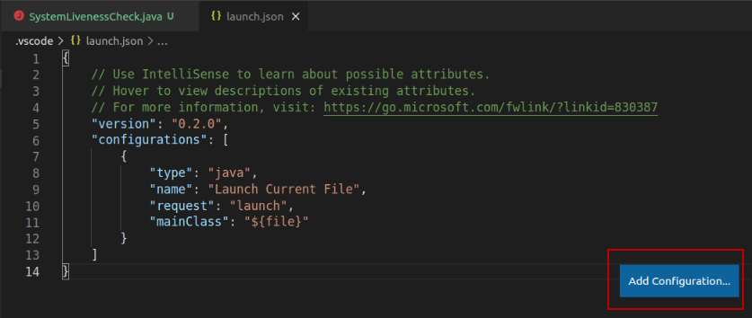
 
    c.  Select **Java: Attach** from the menu that pops up.
        
    
    
    A new configuration is added to the `launch.json` file that includes a `port` parameter to which you can attach a debugger for Liberty.
        
    >**Note:** Open Liberty is configured to use debug port 7777 by default.
        
    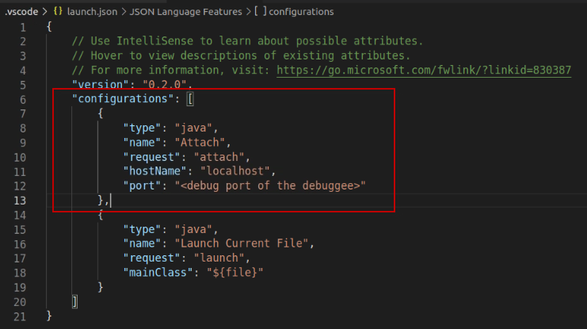

4.  Change the `port` parameter to `7777`.
    
    a.  In the editor, make the following change to the `launch.json`
        file:

    Change the highlighted line: `"port': "<debug port of the debugger>"`

    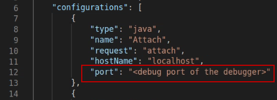
 
    To read: `“port”: 7777`
 
    >**IMPORTANT** Remove the double quotes around 7777, as shown in the screen capture.

    

    b.  Save and close the file. The Liberty server and application are dynamically updated.

5.  Attach the Java Attach configuration

    a.  Switch to the **RUN AND DEBUG** view in VS Code, by clicking the **Run and Debug** icon in the left navigation menu.
    
    

    b.  In the **RUN AND DEBUG** view, click the **Launch current file** menu and select **Attach**.
    
    

    You are now ready to debug.
    
    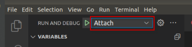

6.  Click the green arrow next to **Attach** to start the debugger.
    
    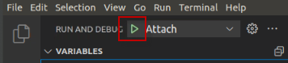
    
    The debugger displays the **CALL STACK** and **BREAKPOINTS** view in the **RUN AND DEBUG** perspective.
    
    

7.  In the browser in the VM, view the `/health` endpoint to see the health status of the application. 

        http://localhost:9080/health

    In the VS Code **RUN AND DEBUG** perspective, the application stops at the breakpoint you set in the `SystemLivenessCheck.java`.

    

    >You can now use the **Step Over**, **Step Into**, **Step Out**, **Restart** or **Disconnect** actions in the toolbar at the top of the editor.

    a.  Click **Step Over** to execute the existing line of code and move to the next line of code in the application.
    
    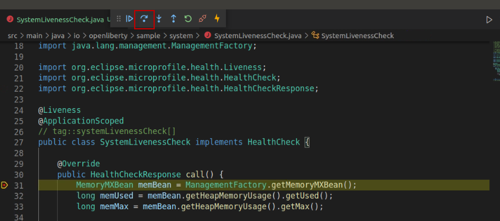

    b. Continue stepping through the code as you want.

8.  When you are finished stepping through the code and exploring the local variables, click **Disconnect** in the toolbar to stop the debugger.
    
    

9. Use **LIBERTY DASHBOARD** to stop the Liberty server in `dev` mode.
    
    a. In VS Code, switch back to the **EXPLORER** view.
    
    b.  Expand **LIBERTY DASHBOARD**.
    
    c.  Right-click the **guide-getting-started** Liberty server.
    
    d.  Select **Stop** from the menu to stop the server.
        
    

    You see new messages in the **TERMINAL** view as the server stops.

10. In the main VS Code menu, click **File** and select **Exit** to exit the UI.

11. Close all terminal windows and browser tabs.

**Congratulations!** You successfully used the Liberty Tools extension in VS Code in development mode to make changes to your application and Liberty server configuration while the server is
running. You ran tests and viewed results, and even debugged the application without
leaving the editor. As you explored the fast and efficient inner-loop development experience with Open Liberty and VS Code, your code was automatically compiled and deployed to your running server, making it easy to iterate on your changes.

**===== END OF LAB =====**